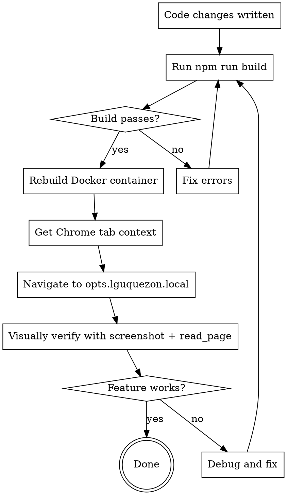

# Docker Build & Chrome MCP Verification

## Overview

Every frontend or feature change MUST be built, deployed to Docker, and visually verified using Claude in Chrome MCP tools against `http://opts.lguquezon.local`. No exceptions.

## The Rule

**You MUST visually verify every feature using Claude in Chrome MCP tools. Code review, build output, and "it looks correct" are NOT verification.**

Violating the letter of this rule is violating the spirit of this rule.

## Mandatory Workflow



### Step 1: Build Frontend Locally

```bash
npm run build
```

This runs `tsc && vite build`. Fix any TypeScript or build errors before proceeding.

### Step 2: Rebuild Docker Container

```bash
cd /Users/jsonse/Documents/development && docker compose up -d --build opts2026
```

Wait for the container to finish building and become healthy. The Dockerfile runs a multi-stage build (composer install, npm build, PHP-FPM + nginx).

### Step 3: Verify with Claude in Chrome MCP

This is the critical step. Use these tools in order:

1. **Get tab context:** `mcp__Claude_in_Chrome__tabs_context_mcp` (with `createIfEmpty: true` if needed)
2. **Navigate:** `mcp__Claude_in_Chrome__navigate` to `http://opts.lguquezon.local` (or the specific page being changed)
3. **Screenshot:** `mcp__Claude_in_Chrome__computer` with `action: "screenshot"` to see the page
4. **Inspect elements:** `mcp__Claude_in_Chrome__read_page` or `mcp__Claude_in_Chrome__find` to verify specific elements exist and have correct content
5. **Interact:** Use `mcp__Claude_in_Chrome__computer` (click, type) or `mcp__Claude_in_Chrome__form_input` to test interactive features
6. **Verify results:** Take another screenshot or read the page after interactions

**Authentication:** If the page requires login, navigate to the login page first, authenticate using Chrome MCP form tools, then proceed to the feature page.

## Red Flags - STOP and Follow This Skill

- About to say "the feature should work based on the code"
- About to claim "build succeeded, so the UI is correct"
- Thinking "I'll skip the Docker rebuild, it takes too long"
- Considering using `localhost:8000` instead of `opts.lguquezon.local`
- Planning to run Playwright CLI tests instead of Chrome MCP verification
- About to commit without visually verifying the change
- Thinking "this is just a small CSS change, no need to check"

**All of these mean: STOP. Build, deploy, verify with Chrome MCP.**

## Quick Reference

| Step | Command / Tool | Purpose |
|------|---------------|---------|
| Build | `npm run build` | TypeScript check + Vite bundle |
| Deploy | `cd /Users/jsonse/Documents/development && docker compose up -d --build opts2026` | Rebuild and restart container |
| Tab context | `tabs_context_mcp(createIfEmpty: true)` | Get Chrome MCP tab ID |
| Navigate | `navigate(url: "http://opts.lguquezon.local", tabId)` | Open the app |
| Screenshot | `computer(action: "screenshot", tabId)` | Visual check |
| Read page | `read_page(tabId)` | Accessibility tree / element check |
| Find element | `find(query: "...", tabId)` | Locate specific UI elements |
| Click | `computer(action: "left_click", coordinate, tabId)` | Interact with elements |
| Type | `computer(action: "type", text, tabId)` | Fill inputs |

## Common Mistakes

| Mistake | Fix |
|---------|-----|
| Skipping Docker rebuild after frontend changes | The app runs in Docker. Local build alone doesn't update what users see. Always rebuild. |
| Using `localhost:8000` | The Docker container serves at `opts.lguquezon.local` via nginx reverse proxy. Use the correct URL. |
| Verifying only with Playwright CLI tests | CLI tests are for CI. Chrome MCP gives you real visual verification in the actual browser. Use Chrome MCP. |
| Not waiting for container to be healthy | After `docker compose up --build`, wait for the build to finish. Check logs if the page doesn't load. |
| Forgetting to authenticate | Most pages require login. Navigate to login first, authenticate, then verify the feature. |

## MySQL in Docker

The MySQL database runs inside the Docker network as the `mysql` service. When debugging data issues:

```bash
# Access MySQL CLI inside the container
cd /Users/jsonse/Documents/development && docker compose exec mysql mysql -u root -p
# Or run artisan commands inside the app container
docker compose exec opts2026 php artisan tinker
```

Do NOT try to connect to MySQL on localhost — it's only accessible within the Docker network.
