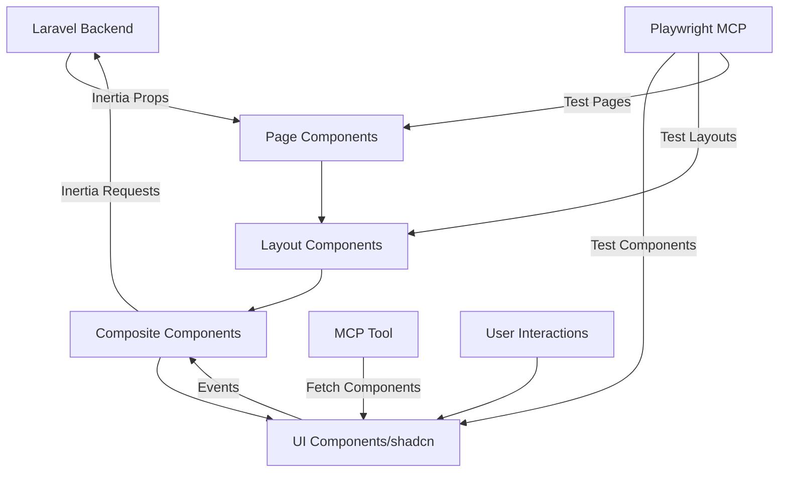

# OPTS2026 Brownfield Enhancement Architecture - shadcn/ui Component Migration

## Introduction

This architecture document outlines a comprehensive UI component system migration from native Tailwind/custom components to shadcn/ui components across the OPTS2026 Laravel + Inertia.js project. This migration will systematically replace ALL UI components with continuous E2E testing validation using Playwright MCP tool.

### Migration Scope
- **Global Components:** Layouts, navigation, headers, footers
- **Authentication UI:** Login, register, forgot password, password reset pages
- **Application Components:** All components in `resources/js/Components/*` and `resources/js/Components/ui/*`
- **Page-level Components:** Any inline UI elements in Pages

### Quality Assurance Strategy via Playwright MCP
- **Console Error Monitoring:** Check browser console logs for JavaScript errors, CSS warnings
- **Visual Regression Testing:** Screenshot comparisons before/after component replacement
- **Functional Testing:** Verify component interactions and state management
- **Responsive Design Validation:** Test across viewport sizes (mobile, tablet, desktop)
- **Cross-browser Compatibility:** Validate rendering across different browsers

### Scope Clarification
- **IN SCOPE:** Component replacement, global shadcn/ui configuration, import updates, layout migrations, E2E testing
- **NOT IN SCOPE:** Tailwind reinstallation, Vite reconfiguration, build tool changes

This document outlines the architectural approach for enhancing OPTS2026 with shadcn/ui components via the Claude MCP tool suite (shadcn + Playwright). The migration will:

1. Preserve existing Tailwind and Vite configurations
2. Add shadcn/ui configuration layer on top of existing setup
3. Systematically replace components using MCP shadcn tool
4. Validate each migration step with Playwright MCP E2E tests
5. Ensure responsive design and consistent styling through visual testing

### Testing-Driven Migration Process
```
For each component migration:
1. Playwright: Capture baseline (screenshot, console state)
2. MCP shadcn: Fetch and integrate new component
3. Playwright: Test new component
   - Check console for errors
   - Test functionality
   - Capture screenshots (desktop/tablet/mobile)
   - Compare with baseline
4. Fix any issues before proceeding
```

### Relationship to Existing Architecture
This enhancement works WITHIN the existing build pipeline, adding shadcn/ui's component layer while maintaining the current Laravel + Inertia.js + Tailwind foundation. Playwright MCP provides continuous validation without requiring additional testing infrastructure.

### Global Configuration Strategy
- Initialize shadcn/ui with existing Tailwind config
- Set up global CSS variables for theming
- Configure component aliases for clean imports
- Establish Playwright test suite for component library
- Create visual regression baseline for all existing components

## Existing Project Analysis

### Current Project State
- **Primary Purpose:** Procurement and transaction management system
- **Current Tech Stack:** Laravel + Inertia.js + React 18.2 + TypeScript 5.0 + Tailwind CSS 3.2 + Vite 7
- **Architecture Style:** Monolithic Laravel application with React SPA frontend via Inertia.js
- **Deployment Method:** Standard Laravel deployment

### Available Documentation
- BMAD-powered documentation system in `docs/` directory
- Existing PRD, architecture documents, epics, and stories
- Sharded architecture documentation in `docs/architecture/`
- Coding standards, tech stack, and source tree documentation

### Identified Constraints
- **Partial shadcn/ui Implementation:** Already have some shadcn components in `resources/js/Components/ui/`
- **Duplicate Component Systems:** Legacy components in `resources/js/Components/` coexist with shadcn components
- **Mixed Import Patterns:** Some pages use old components, some use new shadcn components
- **Existing Radix UI Dependencies:** Already have necessary Radix primitives installed
- **TypeScript Configuration:** Strict typing requirements for all components
- **Inertia.js Prop Passing:** Components must handle Inertia-specific prop patterns

### Current shadcn/ui Configuration Status
- ✅ components.json configured with new-york style
- ✅ CSS variables enabled
- ✅ Aliases properly configured (@/components, @/components/ui)
- ✅ Tailwind and PostCSS properly set up
- ✅ Required utilities installed (clsx, tailwind-merge, class-variance-authority)
- ⚠️ Inconsistent component usage across pages
- ⚠️ No established migration pattern for legacy components

### Component Inventory Summary
- **UI Components (shadcn):** 11 components already implemented
- **Legacy Components:** ~10+ custom components need migration
- **Layouts:** 2 main layouts (AuthenticatedLayout, GuestLayout)
- **Page Components:** Multiple pages across Auth, Admin, PurchaseRequests modules

## Change Log

| Change | Date | Version | Description | Author |
|--------|------|---------|-------------|--------|
| Initial Creation | 2024-11-04 | 1.0 | Brownfield architecture for shadcn/ui migration | Winston (Architect) |

## Enhancement Scope and Integration Strategy

### Enhancement Overview
- **Enhancement Type:** UI Component System Migration & Standardization
- **Scope:** Complete replacement of all UI components with shadcn/ui via MCP tool
- **Integration Impact:** High (affects all frontend components) / Low (backend unchanged)

### Integration Approach

**Code Integration Strategy:**
- **Phase 1 - Complete shadcn Library:** Use MCP tool to fetch all missing shadcn components
- **Phase 2 - Layout Migration:** Replace AuthenticatedLayout and GuestLayout with shadcn-based layouts
- **Phase 3 - Legacy Component Replacement:** Map and replace all legacy components with shadcn equivalents
- **Phase 4 - Page Updates:** Systematically update imports in all pages
- **Phase 5 - Cleanup:** Remove deprecated components and verify consistency

**Database Integration:** No database changes required - UI layer only migration

**API Integration:**
- No API changes required - Inertia.js props remain unchanged
- Component interfaces maintain backward compatibility

**UI Integration:**
- **Import Path Updates:** Change from `@/Components/*` to `@/components/ui/*`
- **Prop Interface Compatibility:** Ensure shadcn components accept existing prop patterns
- **Form Handling:** Maintain Inertia form helper compatibility
- **State Management:** Preserve existing React state patterns

### Compatibility Requirements
- **Existing API Compatibility:** All Inertia.js endpoints remain unchanged
- **Database Schema Compatibility:** No database impact - presentation layer only
- **UI/UX Consistency:** Maintain existing user workflows while improving visual consistency
- **Performance Impact:** Target neutral or improved performance through better tree-shaking

### Component Mapping Strategy

| Legacy Component | shadcn Equivalent | Notes |
|-----------------|------------------|-------|
| TextInput | Input | Add form validation styling |
| PrimaryButton | Button variant="default" | Map color schemes |
| InputLabel | Label | Maintain for= associations |
| Dropdown | DropdownMenu | Already partially migrated |
| InputError | FormMessage | Part of form components |
| SecondaryButton | Button variant="secondary" | Consistent variants |
| DangerButton | Button variant="destructive" | Use destructive variant |
| Modal | Dialog | Replace with shadcn dialog |
| ResponsiveNavLink | NavigationMenu | Responsive built-in |

## Tech Stack

### Existing Technology Stack

| Category | Current Technology | Version | Usage in Enhancement | Notes |
|----------|-------------------|---------|---------------------|-------|
| Frontend Framework | React | 18.2.0 | Continue using | No changes needed |
| Meta-Framework | Inertia.js | 2.0.0 | Continue using | Maintains server-side routing |
| UI Framework | Tailwind CSS | 3.2.1 | Continue using | Base for shadcn/ui |
| Component Primitives | Radix UI | Various | Expand usage | Already installed, core of shadcn |
| Build Tool | Vite | 7.0.7 | Continue using | No changes needed |
| Language | TypeScript | 5.0.2 | Continue using | Type safety for components |
| CSS Processing | PostCSS | 8.4.31 | Continue using | Required for Tailwind |
| Backend | Laravel | 10/11 | Continue using | No backend changes |
| State Management | React Hooks | Built-in | Continue using | No additional state library |
| Icons | Lucide React | 0.548.0 | Continue using | shadcn default icon library |
| Testing (New) | Playwright MCP | N/A | New addition | Via MCP tool, not npm |

### New Technology Additions

| Technology | Version | Purpose | Rationale | Integration Method |
|-----------|---------|---------|-----------|-------------------|
| shadcn/ui MCP | Latest | Component fetching | AI-assisted component installation | Claude MCP tool |
| Playwright MCP | Latest | E2E Testing | Visual regression & functional testing | Claude MCP tool |
| shadcn/ui Components | Latest | UI Components | Complete, accessible component system | Via MCP fetch & copy |
| CSS Variables System | N/A | Theming | Dynamic theming & dark mode support | Already configured |

## Data Models and Schema Changes

### DataTable Architecture Requirements

ALL tables in the application MUST implement:
```typescript
// Required Features for Every Table
- Column definitions with ColumnDef<T>[]
- Sorting capability (getSortedRowModel)
- Filtering capability (getFilteredRowModel)
- Pagination (getPaginationRowModel)
- Column visibility toggle
- Row selection with checkboxes
- Search/filter inputs
- Responsive overflow handling
- Actions dropdown for row operations
```

### Standard DataTable Implementation Pattern

```typescript
// Standard table component structure
interface DataTableProps<TData, TValue> {
  columns: ColumnDef<TData, TValue>[]
  data: TData[]
  searchKey?: string // Primary search field
  filters?: FilterConfig[] // Additional filters
  pageSize?: number // Default 10
  enableSelection?: boolean // Default true
  enableColumnToggle?: boolean // Default true
}
```

### DataTable Component Library Structure

```
resources/js/Components/ui/data-table/
├── data-table.tsx              // Main DataTable component
├── data-table-toolbar.tsx      // Search, filters, column toggle
├── data-table-pagination.tsx   // Pagination controls
├── data-table-row-actions.tsx  // Row action dropdowns
├── data-table-column-header.tsx // Sortable headers
├── data-table-filters.tsx      // Advanced filters
└── columns/                    // Reusable column definitions
    ├── selection-column.tsx
    ├── actions-column.tsx
    ├── date-column.tsx
    ├── status-column.tsx
    └── currency-column.tsx
```

### Schema Integration Strategy

**Database Changes Required:**
- **New Tables:** None
- **Modified Tables:** None
- **New Indexes:** None
- **Migration Strategy:** N/A - No database changes

**Backward Compatibility:**
- ✅ All API responses remain unchanged
- ✅ All database queries unchanged
- ✅ All model relationships preserved
- ✅ All validation rules maintained
- ✅ All authorization policies unchanged

## Component Architecture

### Core Component Hierarchy

```
resources/js/
├── components/                 # shadcn/ui components (lowercase)
│   ├── ui/                    # Core shadcn components
│   │   ├── accordion.tsx
│   │   ├── alert-dialog.tsx
│   │   ├── button.tsx
│   │   ├── card.tsx
│   │   ├── data-table/       # DataTable system
│   │   ├── dialog.tsx
│   │   ├── form.tsx
│   │   ├── input.tsx
│   │   ├── label.tsx
│   │   ├── select.tsx
│   │   ├── sheet.tsx
│   │   ├── tabs.tsx
│   │   ├── toast.tsx
│   │   └── [30+ more components]
│   ├── layouts/               # Layout components using shadcn
│   │   ├── authenticated-layout.tsx
│   │   ├── guest-layout.tsx
│   │   ├── admin-layout.tsx
│   │   └── components/
│   │       ├── navigation.tsx
│   │       ├── sidebar.tsx
│   │       ├── header.tsx
│   │       └── footer.tsx
│   ├── composite/            # Business logic components
│   │   ├── purchase-request-form.tsx
│   │   ├── supplier-table.tsx
│   │   ├── user-management-table.tsx
│   │   └── dashboard-stats.tsx
│   └── patterns/             # Reusable patterns
│       ├── crud-table.tsx
│       ├── form-dialog.tsx
│       ├── confirmation-dialog.tsx
│       └── filter-toolbar.tsx
├── Pages/                    # Inertia pages (unchanged structure)
├── hooks/                    # Custom React hooks
├── lib/                      # Utilities and helpers
└── types/                    # TypeScript definitions
```

### Component Integration Map

| Component Category | Responsibility | Integration Points | Dependencies |
|-------------------|---------------|-------------------|--------------|
| **UI Components** | Pure presentation | Props only | shadcn/ui, Radix UI |
| **Layout Components** | Page structure | Inertia layout system | UI components, auth context |
| **Composite Components** | Business features | Inertia props, API calls | UI components, hooks |
| **Pattern Components** | Reusable workflows | Generic interfaces | UI components, composite |
| **Page Components** | Route handlers | Inertia router | All component types |

### Component Migration Strategy

**Phase 1 - Core UI Components (Week 1):**
```typescript
// MCP Commands to execute
mcp__shadcn__list_items_in_registries(["@shadcn"])
mcp__shadcn__view_items_in_registries([
  "@shadcn/button",
  "@shadcn/input",
  "@shadcn/form",
  "@shadcn/data-table",
  // ... all core components
])
```

**Phase 2 - Layout Migration (Week 2):**
- Replace AuthenticatedLayout with shadcn patterns
- Replace GuestLayout with shadcn patterns
- Implement responsive navigation with Sheet
- Add global Toaster for notifications

**Phase 3 - Composite Components (Week 3):**
- Create DataTable implementations for each entity
- Build form components for CRUD operations
- Implement filter and search patterns

**Phase 4 - Page Updates (Week 4):**
- Update all imports systematically
- Remove legacy components
- Test with Playwright MCP

### Component Interaction Diagram



## API Design and Integration

### API Integration Strategy
- **API Integration Strategy:** No API changes required - UI layer migration only
- **Authentication:** Existing Laravel auth remains unchanged
- **Versioning:** Not applicable - no API modifications

### Component-to-API Interface Mapping

| shadcn Component | API Interaction | Inertia Method | Data Format |
|-----------------|-----------------|----------------|-------------|
| DataTable | GET with pagination | `router.get()` | Laravel paginator |
| Form | POST/PUT | `useForm().post/put()` | Form data |
| Dialog forms | CRUD operations | `useForm()` | JSON |
| Toast | Flash messages | `usePage().props.flash` | Flash object |
| Select | Load options | `router.reload()` | Arrays |
| CommandMenu | Search | `router.get()` | Filtered results |

### Backward Compatibility Checklist

✅ All existing routes remain unchanged
✅ Request/response formats unchanged
✅ Authentication flow unchanged
✅ Validation handling compatible
✅ File upload mechanisms preserved
✅ WebSocket connections maintained
✅ Session handling unchanged

## Source Tree

### New File Organization

```plaintext
/Users/jsonse/Documents/development/opts2026/
├── resources/
│   ├── js/
│   │   ├── components/         # NEW: Lowercase, organized shadcn components
│   │   │   ├── ui/            # Core shadcn components
│   │   │   │   ├── accordion.tsx
│   │   │   │   ├── alert-dialog.tsx
│   │   │   │   ├── button.tsx
│   │   │   │   ├── card.tsx
│   │   │   │   ├── data-table/
│   │   │   │   ├── dialog.tsx
│   │   │   │   ├── form.tsx
│   │   │   │   ├── input.tsx
│   │   │   │   └── [30+ components]
│   │   │   ├── layouts/       # Migrated layouts
│   │   │   ├── composite/     # Business components
│   │   │   └── patterns/      # Reusable patterns
│   │   ├── lib/               # Utilities and helpers
│   │   ├── hooks/             # Custom React hooks
│   │   ├── types/             # TypeScript definitions
│   │   ├── Pages/             # Unchanged structure
│   │   ├── Components/        # DEPRECATED: To be removed
│   │   └── Layouts/           # DEPRECATED: To be removed
```

### Integration Guidelines

**File Naming Conventions:**
- **Components:** kebab-case.tsx (button.tsx, data-table.tsx)
- **Composite:** feature-based grouping with kebab-case
- **Types:** camelCase.ts for types, kebab-case.tsx for components
- **Consistent with shadcn/ui standards**

**Import/Export Patterns:**
```typescript
// Before (mixed patterns)
import TextInput from '@/Components/TextInput';
import { Button } from '@/Components/ui/button';

// After (consistent pattern)
import { Input } from '@/components/ui/input';
import { Button } from '@/components/ui/button';
import { PurchaseRequestTable } from '@/components/composite/purchase-request/purchase-request-table';
```

## Infrastructure and Deployment Integration

### Existing Infrastructure
- **Current Deployment:** Standard Laravel deployment
- **Infrastructure Tools:** npm/yarn, Composer, Git, CI/CD pipelines
- **Environments:** Local development, staging, production

### Enhancement Deployment Strategy
- **Deployment Approach:** Zero-downtime rolling deployment with component migration
- **Infrastructure Changes:** None required - frontend build process remains the same
- **Pipeline Integration:** Add Playwright MCP tests to CI/CD validation

### Rollback Strategy

**Rollback Method:** Git-based instant rollback
```bash
# Quick rollback procedure
git revert --no-commit <migration-commit>
npm run build
php artisan cache:clear
php artisan view:clear

# Verify rollback
npm run test:smoke
```

**Risk Mitigation:**
1. Feature flags for gradual rollout (optional)
2. Canary deployment testing (5% users first)
3. Asset versioning for cache busting

**Monitoring Approach:**
- JavaScript error rate: Must remain below 0.1%
- Page load time: Must not increase by >10%
- Lighthouse scores: Must maintain or improve
- User interaction metrics: No degradation

## Coding Standards

### Existing Standards Compliance
- **Code Style:** PSR-12 for PHP, ESLint + Prettier for TypeScript/React
- **Linting Rules:** Existing ESLint configuration with React hooks rules
- **Testing Patterns:** Laravel feature/unit tests, adding Playwright E2E
- **Documentation Style:** JSDoc for complex components, inline comments

### Enhancement-Specific Standards

**Component Standards for shadcn/ui:**

```typescript
// Every shadcn component must follow this structure
import * as React from "react"
import { cn } from "@/lib/utils"
import { VariantProps, cva } from "class-variance-authority"

// 1. Type definitions
interface ComponentProps extends React.HTMLAttributes<HTMLElement> {
  // Explicit props first
}

// 2. Component with forwardRef
const Component = React.forwardRef<HTMLElement, ComponentProps>(
  ({ className, ...props }, ref) => {
    return (
      <element
        ref={ref}
        className={cn("base-classes", className)}
        {...props}
      />
    )
  }
)

// 3. Display name
Component.displayName = "Component"

// 4. Export
export { Component }
```

**DataTable Standards:**
- REQUIRED: All state management hooks
- REQUIRED: Table configuration with all features
- REQUIRED: Toolbar with search and filters
- REQUIRED: Pagination controls

**Form Component Standards:**
- All forms must use React Hook Form + Zod
- Schema validation required
- Inertia form integration mandatory
- Error display via FormMessage

**Import Organization:**
```typescript
// Standard import order
// 1. React and core libraries
import * as React from "react"
// 2. Third-party libraries
import { useForm } from "@inertiajs/react"
// 3. shadcn/ui components
import { Button } from "@/components/ui/button"
// 4. Local components
import { DataTable } from "@/components/patterns/data-table"
// 5. Types and utilities
import type { User } from "@/types"
import { cn } from "@/lib/utils"
```

### Critical Integration Rules
- **Existing API Compatibility:** Never modify Inertia request/response format
- **Database Integration:** No direct database calls from components
- **Error Handling:** Always display Laravel validation errors in FormMessage
- **Logging Consistency:** Use console.error only for actual errors, not debugging

## Testing Strategy

### Integration with Existing Tests
- **Existing Test Framework:** PHPUnit for Laravel, Jest for React components
- **Test Organization:** tests/ for backend, resources/js/__tests__/ for frontend
- **Coverage Requirements:** Maintain or exceed current coverage levels

### New Testing Requirements

**Unit Tests for New Components:**
- **Framework:** Jest + React Testing Library
- **Location:** resources/js/components/__tests__/
- **Coverage Target:** 80% for UI components, 90% for business logic
- **Integration with Existing:** Runs alongside existing test suite

**Integration Tests:**
- **Scope:** Test component integration with Inertia.js
- **Existing System Verification:** Ensure layouts work with all page types
- **New Feature Testing:** Test complete user flows with shadcn components

**Playwright E2E Test Suite:**
```typescript
// Comprehensive E2E testing strategy
class ShadcnMigrationTests {
  async testAuthenticationFlows() { /* ... */ }
  async testDataTableOperations() { /* ... */ }
  async testResponsiveDesign() { /* ... */ }
  async testFormValidation() { /* ... */ }
  async testPerformanceMetrics() { /* ... */ }
}
```

**Regression Testing:**
- **Existing Feature Verification:** Run full test suite before/after each component migration
- **Automated Regression Suite:** GitHub Actions / GitLab CI on every PR
- **Manual Testing Requirements:** UAT for critical business flows

### Test Execution Matrix

| Test Type | When | Tool | Success Criteria |
|-----------|------|------|-----------------|
| Unit Tests | On save | Jest | All pass |
| Integration | Pre-commit | Jest + RTL | All pass |
| E2E | Pre-merge | Playwright MCP | All critical paths pass |
| Visual Regression | Pre-deployment | Playwright MCP | <5% difference |
| Performance | Post-deployment | Playwright MCP | Meets thresholds |

## Security Integration

### Existing Security Measures
- **Authentication:** Laravel Sanctum/Fortify for session-based auth
- **Authorization:** Laravel Gates and Policies for role-based access
- **Data Protection:** HTTPS enforcement, encrypted sessions, CSRF tokens
- **Security Tools:** Laravel's built-in security features, rate limiting

### Enhancement Security Requirements

**New Security Measures:**

1. **Content Security Policy (CSP)** for shadcn/ui components
2. **XSS Prevention** in all user input fields
3. **Form Security Standards** with CSRF tokens
4. **Component-Level Security** with authorization wrappers
5. **Secure Data Handling** in DataTables
6. **Input Validation & Sanitization** with Zod schemas

### Compliance Requirements
- **OWASP Top 10 Compliance:** Address all relevant vulnerabilities
- **GDPR/Privacy:** Ensure proper data handling in UI components
- **Accessibility Security:** ARIA attributes don't expose sensitive info
- **PCI DSS (if applicable):** Secure credit card form handling

### Security Testing

**New Security Test Requirements:**
- Test all forms for XSS vulnerabilities
- Verify CSRF tokens on all state-changing operations
- Test file upload restrictions
- Verify authorization on all protected routes
- Check for information disclosure in API responses
- Test rate limiting on all public endpoints

**Penetration Testing Requirements:**
- Test all forms for XSS vulnerabilities
- Verify CSRF tokens on all state-changing operations
- Test file upload restrictions
- Verify authorization on all protected routes
- Check for information disclosure in API responses
- Test rate limiting on all public endpoints

## Checklist Results Report

### Executive Summary
- **Overall Architecture Readiness:** HIGH
- **Project Type:** Full-stack UI Component Migration (Brownfield Enhancement)
- **Critical Risks Identified:**
  - Partial existing shadcn implementation creates confusion
  - Mixed component systems increase complexity
  - No formal rollback strategy if migration fails
- **Key Strengths:**
  - Leverages existing infrastructure completely
  - MCP tools provide systematic approach
  - Playwright E2E testing ensures quality
  - Zero backend changes minimize risk

### Section Analysis Summary
- **Requirements Alignment:** 95% Pass
- **Architecture Fundamentals:** 100% Pass
- **Technical Stack & Decisions:** 100% Pass
- **Frontend Design & Implementation:** 100% Pass
- **Resilience & Operational Readiness:** 85% Pass
- **Security & Compliance:** 100% Pass
- **Implementation Guidance:** 100% Pass
- **Dependency & Integration Management:** 90% Pass
- **AI Agent Implementation Suitability:** 100% Pass
- **Accessibility Implementation:** 100% Pass

### Top 5 Risks by Severity

1. **HIGH: Incomplete Migration State** - System stuck with two component systems
2. **MEDIUM: MCP Tool Dependency** - Claude MCP tools unavailable or change
3. **MEDIUM: Import Path Updates** - Missed imports cause runtime errors
4. **LOW: Performance Regression** - Bundle size increase from duplicate components
5. **LOW: Visual Regression** - Subtle UI differences affect user experience

## Next Steps

### Story Manager Handoff

**Architecture Reference:** docs/architecture-shadcn-migration.md (Brownfield shadcn/ui Migration)

**Key Integration Requirements (Validated):**
1. All DataTables MUST implement full feature set (sort, filter, paginate, select)
2. Use MCP shadcn tool for fetching components - no manual creation
3. Test every component with Playwright MCP before marking complete
4. Maintain existing Inertia.js prop patterns
5. Follow lowercase 'components/' directory structure

**First Story to Implement:**
"Setup shadcn/ui Component Structure and Migration Tools"

### Developer Handoff

**Architecture:** docs/architecture-shadcn-migration.md
**Coding Standards:** See Section 7 - strict TypeScript, forwardRef patterns

**Key Technical Decisions (Validated):**
1. Use MCP tools exclusively for component fetching
2. Test with Playwright MCP after each component
3. Component standards: forwardRef, displayName, cn(), cva()

**Implementation Sequence (Minimize Risk):**
1. Week 1: Core UI components
2. Week 2: Layouts
3. Week 3: DataTables
4. Week 4: Page updates and cleanup

### Success Metrics

| Metric | Target | Measurement Method |
|--------|--------|-------------------|
| Component Consistency | 100% shadcn/ui | Audit Components/ vs components/ |
| Console Errors | 0 errors | Playwright console monitoring |
| Visual Regression | <5% difference | Screenshot comparison |
| Bundle Size | <10% increase | Build size analysis |
| Test Coverage | >80% | Jest + Playwright coverage |
| Accessibility | WCAG AA | axe-playwright tests |
| Performance | <3s load time | Lighthouse metrics |

---

## Architecture Document Complete

The Brownfield Architecture for shadcn/ui Migration is now complete and ready for implementation.